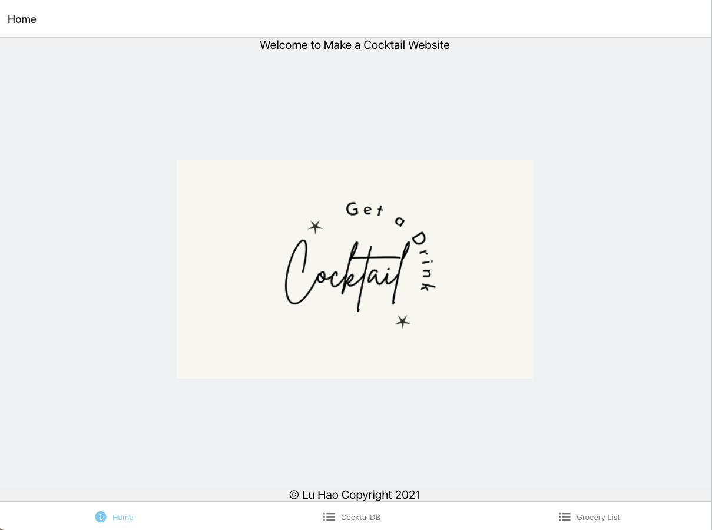
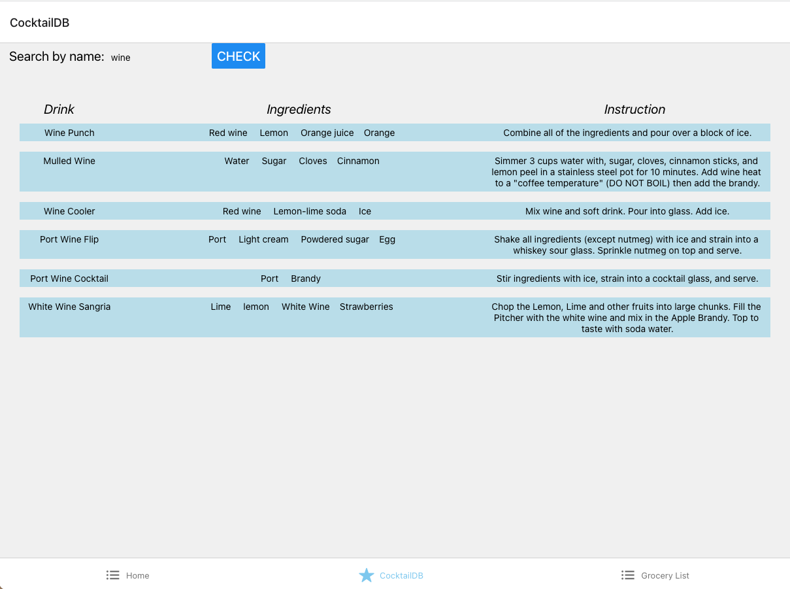
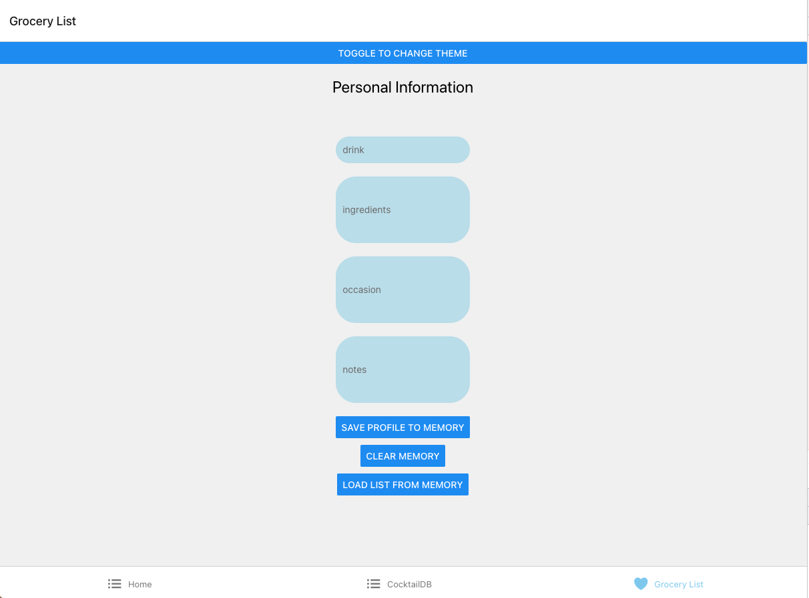

# FindMyRoomate

  ## Table of Contents

  - [Description](#description)

  - [Github links](#links)

  - [Screenshots](#screenshots)

  - [Developers](#developers)

  - [Usage](#usage)

  - [Contributing](#contributing)

  - [Technologies](#technologies)

  - [Questions](#questions)

  ## Description

  A react native app that helps find a cocktail recipe and add ingridients to your grocery list. 

  ## Links

  Repo: https://github.com/lhaodev/CreativeProject

  ## Screenshots

  

  

  

  ## Developers

  Lu Hao: React Native

  ## Usage

  Make a Cocktail is designed as react native app that helps you find a cocktail recipe and add the ingredients to your grocery list.

  To use this application once installed, the user installs all the packages using

    npm install
  
  then the user launches the application from a terminal window as follows:

    expo start

  This will then open a browser window at localhost:19006.

  To run it on your phone, user need to install 
    
    expo go 

  ## Contributing

  This project is free open-source software (FOSS). Please contact the developers for more information.

  ## Technologies
 
  - React native
  - Axios
  - CSS
  - Dotenv

  ## Questions
  If you have any questions, please connect with the developer through the following contact info. 
  
  Developer Github profiles:
  Lu Hao: https://github.com/lhaodev 

  
 
